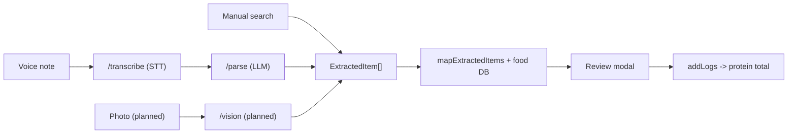

# ProteinMate Roadmap

## Overview

**ProteinMate is anybody's protein tracking mate** — the fastest, lowest-friction way for anyone to hit a daily protein goal.

It is **single-metric by design**: it tracks protein and nothing else. There is first-class support for Hinglish voice and real-world serving units (katori, roti, scoop, glass), but the product is universal, not India-specific.

### Scope guardrail

The app does **one thing**: track protein.

- No calories. No carbs/fat. No general macro or "full nutrition" tracking — now or on this roadmap.
- Every feature must make protein tracking **faster, more accurate, or stickier**. If it doesn't, it is out of scope.

This guardrail exists on purpose: the moment the app tries to be a general nutrition tracker, it loses the speed and focus that make it worth using.

## Current status (shipped)

- **Core tracker** — food search, serving picker, custom foods, daily goal, streaks, and a shareable progress card.
- **Modular architecture** — `src/domain` (pure logic), `src/storage` (persistence), `src/features/tracker` (UI + hooks), `src/services` (clients).
- **Voice logging MVP** — record → transcribe → parse → review → log:
  - [src/features/tracker/useVoiceLogging.ts](../src/features/tracker/useVoiceLogging.ts) orchestrates the flow.
  - [src/services/sttClient.ts](../src/services/sttClient.ts) talks to the proxy.
  - [server/index.js](../server/index.js) exposes `/transcribe` (OpenAI STT) and `/parse` (Ollama Cloud), keeping API keys server-side.
  - `mapExtractedItems` in [src/domain/voiceParsing.ts](../src/domain/voiceParsing.ts) maps structured items onto the food DB with deterministic protein math; the parse prompt normalizes Hindi/Devanagari to romanized names.
- **Tests** — deterministic Vitest coverage for parsing/serving logic, plus opt-in live `/parse` integration tests.

## Architecture: the shared logging pipeline

Every logging method funnels into the same path. Anything that can produce an `ExtractedItem[]` (see [src/domain/types.ts](../src/domain/types.ts)) reuses the entire match → review → log flow for free.

This is the key extension seam: new input methods (photo, etc.) only need to emit `ExtractedItem[]`.

## Phased roadmap

Effort is rough: S (hours), M (a session or two), L (multi-session).

### Phase 1 — Multimodal logging & retention

- **Photo-based logging (NEXT UP)** — add a `/vision` proxy endpoint that sends an image to **OpenAI `gpt-4o-mini`** (decided) and returns the same `{ items: [{ name, quantity, unit }] }` JSON. Add `expo-image-picker` / camera and a "Log by photo" button. Reuses `mapExtractedItems`, the review modal, and `addLogs` unchanged.
  - Effort: M. Risk: estimating portion size from a photo is hard — the existing human-review step is what makes it usable; frame it as a best-guess list you confirm.
- **Protein reminders / nudges** — local notifications via `expo-notifications` (e.g. "40 g to go today"). No backend, no bot.
  - Effort: S.
- **Protein history & charts** — trends over time from `logs` in [src/storage/proteinMateStorage.ts](../src/storage/proteinMateStorage.ts): daily protein, goal-hit rate, weekly averages.
  - Effort: M.

### Phase 2 — Accuracy & protein data depth

- **Edit-after-log and one-tap re-log** — fix a logged serving; quickly repeat a common item.
  - Effort: S.
- **Expand the protein food DB** — more foods, more aliases, and better `proteinPer100g` accuracy in [src/domain/foods.ts](../src/domain/foods.ts). Directly improves match rate for voice/photo.
  - Effort: M.
- **Barcode scanning (protein-only)** — look up packaged foods (e.g. Open Food Facts) and ingest **only** protein-per-100g into the existing `Food` / `Serving` shape. No other nutrients stored. Scanned products **auto-save** into a local cache as a new `source: 'barcode'`, keyed by the barcode, so repeat scans resolve instantly and offline and become searchable — kept separate from the curated `FOOD_DB` seed. The review modal still confirms before logging.
  - Open decision (defer until we build this): which persistence layer backs the barcode cache (extend the existing AsyncStorage state in [src/storage/proteinMateStorage.ts](../src/storage/proteinMateStorage.ts) vs a dedicated store).
  - Effort: M-L.
- **Onboarding + protein-goal calculator** — bodyweight-based daily protein target that sets `goal` in [src/storage/proteinMateStorage.ts](../src/storage/proteinMateStorage.ts).
  - Effort: S-M.

### Phase 3 — Stickiness, sync & polish

- **Home-screen widget** — today's protein vs goal at a glance.
  - Effort: M.
- **Cloud backup / sync** — accounts and synced protein logs across devices.
  - Effort: L.
- **Optional messaging-bot companion** — log protein via Discord/WhatsApp, reusing the existing proxy + `mapExtractedItems`. Captured as optional, not committed.
  - Effort: M.

## Cross-cutting concerns

- **Testing** — keep domain logic deterministic and unit-tested; gate live LLM/network tests behind an env flag (`RUN_LLM_PARSE_TESTS`).
- **Cost** — STT/vision are billed per call; the single-metric protein focus keeps prompts and responses small and cheap.
- **Privacy & secrets** — all provider keys stay server-side in the proxy; the app never ships a key. `.env` is gitignored; only `server/.env.example` is tracked.

## Decisions

- **Vision model:** OpenAI `gpt-4o-mini` for photo logging.
- **Build order:** photo logging first; barcode scanning as a follow-up.
- **Barcode persistence:** scanned products auto-save into a local, searchable cache (new `source: 'barcode'`), separate from the curated seed.

## Open questions

- Acceptable protein-estimate accuracy from photos, and how to set user expectations in the UI.
- Persistence layer for the barcode food cache (extend AsyncStorage state vs a dedicated store) — to be decided before building barcode.
